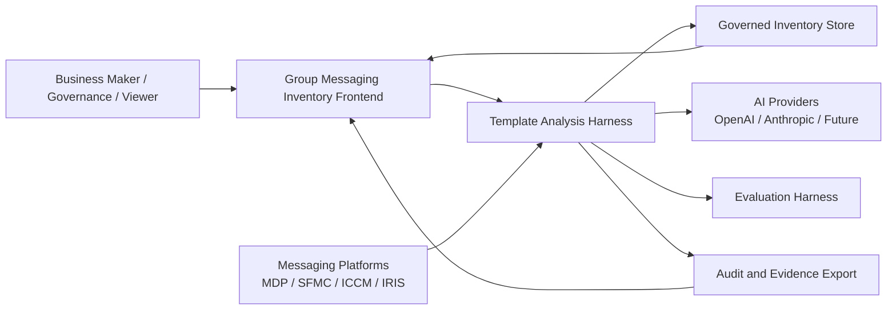
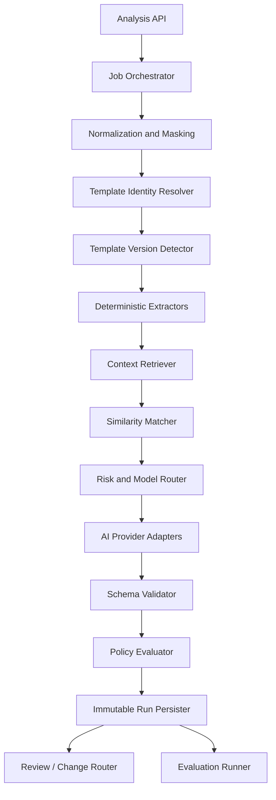
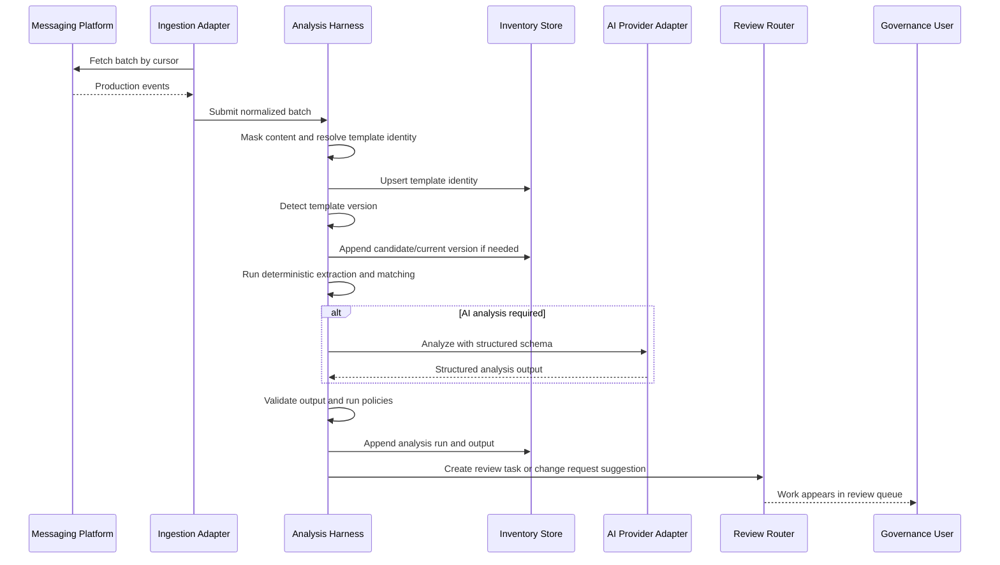
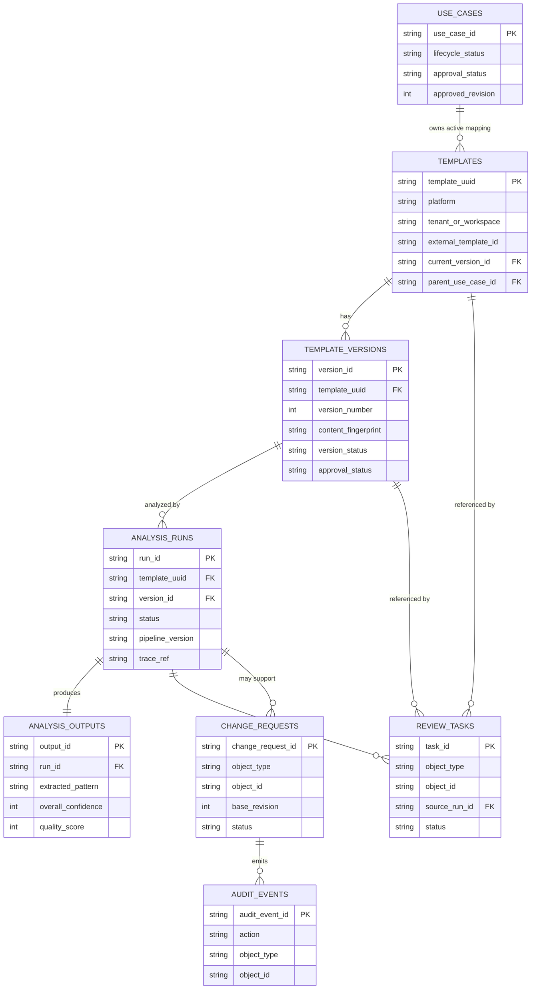
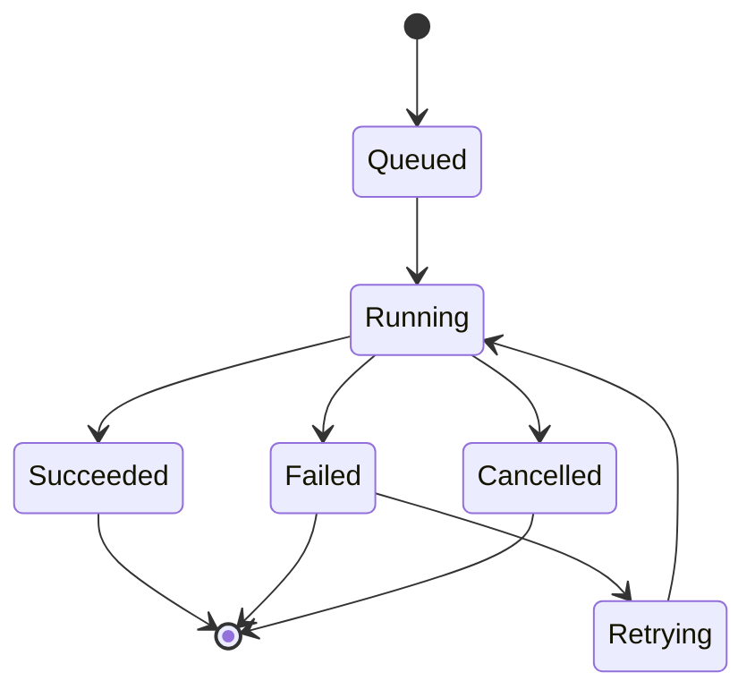
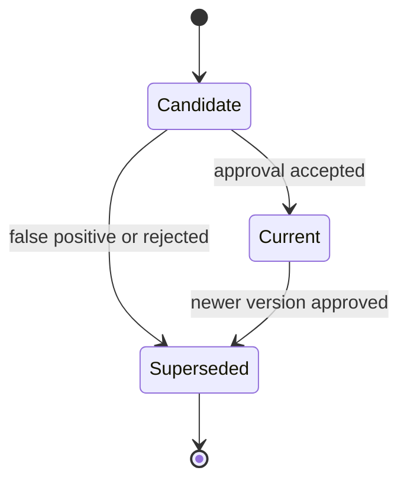
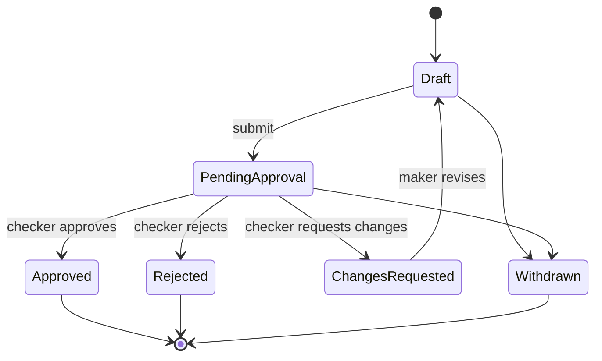
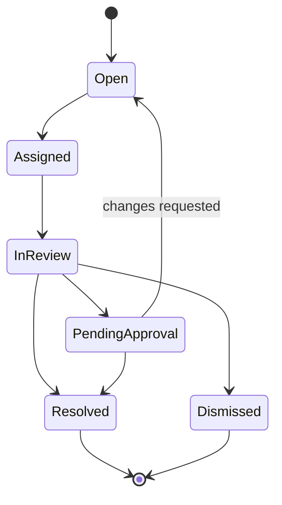

# Templates Analysis Harness Backend Architecture

Date: 2026-06-26

Status: v2 implementation-ready draft

## 1. Purpose

This document designs the backend architecture for the Group Messaging Inventory **Templates Analysis** capability.

The system should not be a thin "call an AI model and save a result" service. It should be a governed **analysis harness**: a reproducible runtime that can ingest production messaging signals, detect template versions, run deterministic and AI analysis, evaluate output quality, preserve immutable evidence, and route decisions into maker-checker governance.

## 2. Product Context

The current product requirements define these important constraints:

- Use Case is the primary governed business object.
- Template is a technical implementation asset discovered from production data.
- Template identity is `Platform + Tenant/Workspace + Template ID`, plus a stable internal Template UUID.
- Template Version is immutable and created when material content or configuration changes.
- Analysis Run is immutable evidence for one execution of extraction, matching, clustering, rules, or AI analysis.
- AI produces suggestions; authorized humans make governed decisions.
- Important changes must flow through maker-checker approval.
- Re-analysis must create a new Analysis Run and must not overwrite previous runs or human decisions.

These constraints push the backend toward an evented, versioned, evidence-first architecture.

## 3. June 2026 Industry Research

This section focuses on OpenAI and Anthropic material from June 2026, plus architecture implications for this project.

### 3.1 OpenAI: Production Agents Require Orchestration, Guardrails, and Evals

OpenAI's agent-building guidance describes agentic systems as more than a model call. A production agent has tool use, orchestration, guardrails, human oversight, tracing, and continuous evaluation. The guidance is especially relevant to Templates Analysis because template classification and matching are not single-shot tasks; they require deterministic preprocessing, retrieved context, policy checks, and auditable handoff to a human workflow.

Implications for this project:

- Treat the analysis runtime as an orchestrator with explicit steps, not as a direct model adapter.
- Put deterministic extractors and policy evaluators before and after AI calls.
- Keep every run traceable: input snapshot, prompt version, model version, retrieved context, ruleset, output, warnings, and decision.
- Build a regression evaluation loop for model, prompt, ruleset, and retriever changes before promoting them to production.
- Route high-risk actions such as merge, reassign, retire, and approve through human review.

Reference: [OpenAI Building agents track](https://developers.openai.com/tracks/building-agents)

### 3.2 OpenAI: Evals as a Release Gate

OpenAI's evaluations guidance frames evals as a way to measure task performance, compare model or prompt changes, and keep quality from drifting. For this product, evals should not be limited to AI answer correctness. They should test the whole harness: masking, extraction, version detection, matching, classification suggestion, explanation quality, and safe routing.

Implications for this project:

- Maintain a golden set of template versions with expected patterns, variables, classifications, candidate matches, and review-routing decisions.
- Run evals whenever model, prompt, embedding, ruleset, or normalization logic changes.
- Store eval results as first-class release evidence.
- Use threshold gates for rollout, for example minimum extraction F1, classification accuracy, PII masking pass rate, and acceptable false-merge rate.

Reference: [OpenAI Evals documentation](https://platform.openai.com/docs/guides/evals)

### 3.3 OpenAI: Responses/Agents Runtime Patterns

OpenAI's platform guidance around Responses and agents points toward a unified runtime where model reasoning, tool calls, structured outputs, and tracing are part of the same execution model. For Templates Analysis, this suggests a narrow external interface for analysis jobs and a deeper internal implementation that can vary model/provider/tool choices over time.

Implications for this project:

- Define a stable `AnalysisHarness` interface and keep provider-specific details behind adapters.
- Require structured outputs from AI steps; never parse free-form prose as the canonical result.
- Preserve a trace for every run, even when the final output is compact.
- Make model routing an implementation detail: rules-only, small model, or strong model can be chosen per risk and confidence.

References:

- [OpenAI Agents documentation](https://platform.openai.com/docs/guides/agents)
- [OpenAI Responses API documentation](https://platform.openai.com/docs/guides/responses)

### 3.4 OpenAI: June 2026 Codex Remote Signals Trace/Eval/Steering Loops

OpenAI's June 23, 2026 developer post on Codex Remote highlights long-running engineering work controlled through remote steering, review, and organization. The surrounding Codex developer material also points to agent improvement loops built from traces, evals, and iterative repair. The direct product lesson is that production AI systems need operational loops around the model: users start work, inspect traces/results, steer when needed, and rely on evals to improve the harness over time.

Implications for this project:

- Treat Templates Analysis as a long-running backend workflow, not a synchronous button-click model call.
- Persist traces and intermediate outputs so reviewers can inspect why a run behaved as it did.
- Support human steering through re-analysis, confirmation, rejection, and change-request workflows.
- Use evaluation reports as promotion evidence when changing prompts, rules, model routing, or retrievers.

Reference: [OpenAI Developer Blog: Mastering Codex Remote for engineering](https://developers.openai.com/blog/mastering-codex-remote-for-engineering)

### 3.5 Anthropic: June 2026 Model Releases Emphasize Safety Evals and Enterprise Reliability

Anthropic's June 2026 model-release material for Claude Opus 4.8, Claude Fable 5, and Claude Mythos 5 repeatedly emphasizes safety evaluation, alignment assessment, safeguards, reliability, and enterprise workflows. Opus 4.8 also introduces dynamic workflows in Claude Code research preview, where Claude can plan larger tasks, run many parallel subagents, and verify outputs before reporting back.

Implications for this project:

- Do not promote a model, prompt, or ruleset change without a pre-deployment evaluation suite.
- Use parallel specialist workers internally when their responsibilities are separate, such as extraction, matching, policy evaluation, and explanation.
- Require the harness to verify its own outputs before creating review tasks or suggested change requests.
- Expose an effort/risk control: deterministic pass, normal AI pass, and enhanced review pass.
- Prefer model output that explicitly flags uncertainty over output that hides weak evidence behind high confidence.

References:

- [Anthropic: Introducing Claude Opus 4.8](https://www.anthropic.com/news/claude-opus-4-8)
- [Anthropic: Claude Fable 5 and Claude Mythos 5](https://www.anthropic.com/news/claude-fable-5-mythos-5)

### 3.6 Anthropic: System Risk Lives in the Whole Agentic Stack

Anthropic's June 2026 writing on AI safety and agentic systems stresses that risks emerge from the full stack: model, tools, environment, permissions, and operational context. That maps directly to this product. The dangerous event is not "the model suggested Servicing"; it is "a system accepted a wrong suggestion, reassigned a Template, changed a Use Case, or exported evidence without review."

Implications for this project:

- Model output is advisory evidence, not a command.
- Separate analysis suggestions from governed state transitions.
- Apply policy gates to tool-like actions such as merge, demise, reassign, activate candidate version, and export.
- Preserve enough context to reconstruct why a human approved or rejected a suggestion.

Reference: [Anthropic: Our framework for developing safe and trustworthy agents](https://www.anthropic.com/news/our-framework-for-developing-safe-and-trustworthy-agents)

### 3.7 Anthropic Claude Code: Subagents, Skills, Hooks, and Effort Control

Anthropic's Claude Code documentation reflects a harness-oriented pattern: specialized subagents, reusable skills, hooks for lifecycle control, and effort controls. Even though Claude Code is a developer tool, the architecture pattern is useful here.

Implications for this project:

- Split analysis into specialized internal workers: masking, extraction, version detection, matching, classification, explanation, and evaluation.
- Use explicit lifecycle hooks around analysis jobs: before-run validation, after-run persistence, post-run policy routing, and audit emission.
- Use reusable analysis "skills" as versioned prompt/rules packages instead of scattering prompt text across services.
- Expose effort/risk controls: high-confidence deterministic pass, normal AI pass, or enhanced review pass.

References:

- [Claude Code subagents](https://docs.anthropic.com/en/docs/claude-code/sub-agents)
- [Claude Code skills](https://docs.anthropic.com/en/docs/claude-code/skills)
- [Claude Code hooks](https://docs.anthropic.com/en/docs/claude-code/hooks)

## 4. Architecture Principles

1. **Harness before model**
   The backend owns orchestration, evidence, evaluation, retries, and governance routing. AI providers are replaceable adapters.

2. **Immutable evidence**
   Template Versions, Analysis Runs, evaluation results, and audit events are append-only.

3. **Human accountability**
   Analysis can suggest changes. Only approved Change Requests update governed snapshots.

4. **Deep module interface**
   Callers should learn a small analysis interface while the harness hides provider routing, retry, masking, extraction, matching, and eval complexity.

5. **Structured outputs only**
   AI steps must emit validated JSON matching versioned schemas.

6. **Risk-based execution**
   Low-risk, high-confidence cases can use deterministic paths. Low-confidence or high-impact cases require stronger analysis and human review.

7. **Evaluation is part of delivery**
   A new prompt, model, retriever, or ruleset is not production-ready until it passes regression gates.

## 5. High-Level Architecture

```text
Platform Logs
  -> Ingestion Adapters
  -> Normalization and Masking
  -> Template Identity Resolver
  -> Template Version Detector
  -> Analysis Harness
       -> Deterministic Extractors
       -> Similarity Matcher
       -> AI Analysis Adapters
       -> Policy Evaluators
       -> Quality Evaluators
  -> Immutable Analysis Run Store
  -> Review Task / Change Request Router
  -> Maker-checker Governance
  -> Evidence Export
```

### 5.1 System Context



### 5.2 Harness Component View



### 5.3 Production Discovery Sequence



### 5.4 Data Relationship View



## 6. Core Modules

### 6.1 Ingestion Adapter

Purpose: ingest production events from MDP, SFMC, ICCM, and IRIS.

Interface:

```ts
type IngestionAdapter = {
  fetchBatch(cursor: SourceCursor): Promise<IngestedEventBatch>;
};
```

Responsibilities:

- Source authentication and pagination.
- Source lineage capture.
- Idempotency keys.
- Raw event landing.
- Cursor/watermark management.

Non-responsibilities:

- Classification.
- Use Case matching.
- Governance decisions.

### 6.2 Normalization and Masking

Purpose: convert platform-specific records into a shared event contract while minimizing sensitive data.

Responsibilities:

- Normalize platform, tenant, workspace, channel, market, sender identity, template id, timestamp, and delivery outcome.
- Mask or tokenize content before analysis.
- Produce a masked input summary for Analysis Runs.
- Preserve source lineage separately from user-facing content.

### 6.3 Template Identity Resolver

Purpose: resolve the Template business identity and stable internal UUID.

Business key:

```text
platform + tenant_or_workspace + external_template_id
```

Responsibilities:

- Create `template_uuid` for new composite identities.
- Detect collisions and corrected metadata.
- Ensure external Template ID alone is never treated as globally unique.

### 6.4 Template Version Detector

Purpose: detect material content or configuration changes beneath the same Template identity.

Responsibilities:

- Generate content and configuration fingerprints.
- Compare with current and historical versions.
- Create Candidate Version records.
- Preserve Current and Superseded versions.
- Attach production events to the version observed at event time.

### 6.5 Analysis Harness

Purpose: orchestrate one complete analysis run for a Template Version or review item.

External interface:

```ts
type AnalysisHarness = {
  submitRun(input: SubmitAnalysisRun): Promise<AnalysisRunRef>;
  getRun(runId: string): Promise<AnalysisRunDetail>;
  rerun(runId: string, options: RerunOptions): Promise<AnalysisRunRef>;
  compareRuns(leftRunId: string, rightRunId: string): Promise<AnalysisRunDiff>;
};
```

Internal stages:

1. Validate input and permissions.
2. Load Template Version snapshot.
3. Load approved Use Case and Template context.
4. Run deterministic extraction.
5. Run similarity matching.
6. Decide whether AI analysis is needed.
7. Run provider adapter with structured output schema.
8. Validate output and calculate confidence.
9. Run policy and quality evaluators.
10. Persist immutable run and trace.
11. Route follow-up task or change request suggestion.

### 6.6 AI Provider Adapters

Purpose: isolate OpenAI, Anthropic, or future providers behind a small interface.

Interface:

```ts
type AiAnalysisAdapter = {
  analyzeTemplate(input: AiTemplateAnalysisInput): Promise<AiTemplateAnalysisOutput>;
};
```

Provider-specific concerns hidden inside adapters:

- Model names.
- Prompt format.
- Tool or structured-output syntax.
- Token budgeting.
- Retries and provider errors.
- Trace normalization.

Required output properties:

- Extracted template pattern.
- Placeholder list and placeholder types.
- AI message type suggestion.
- Governance classification suggestion.
- Candidate Use Case matches.
- Similar Template matches.
- Field-level confidence.
- Overall confidence.
- Business explanation.
- Technical evidence.
- Warnings and uncertainty.

### 6.7 Policy Evaluator

Purpose: decide whether the result can be displayed, requires review, or must be blocked.

Example policies:

- PII masking must pass before AI calls.
- No AI output can directly change Approved Snapshot.
- Merge suggestions above a threshold still require approval.
- Retired-but-live traffic always creates a Drift Task.
- Low confidence creates a Review Task.
- Contradiction between deterministic rules and AI classification creates a Review Task.
- Any high-impact action requires maker-checker approval.

### 6.8 Evaluation Harness

Purpose: continuously test the analysis harness.

Evaluation dimensions:

- Masking safety.
- Placeholder extraction accuracy.
- Template pattern correctness.
- Template version detection.
- Candidate Use Case matching.
- Governance classification suggestion.
- Explanation usefulness.
- False merge rate.
- False retirement/demise rate.
- Runtime, cost, retries, and provider error rate.

Evaluation data:

- Golden template versions.
- Historical human decisions.
- Synthetic edge cases.
- Known PII masking traps.
- Known confusing pairs of similar templates.
- Drift and retired-but-live scenarios.

Minimum evaluation suites:

```text
masking_safety
placeholder_extraction
template_version_detection
classification_suggestion
use_case_matching
policy_routing
explanation_quality
provider_regression
```

Promotion gates:

| Metric | Minimum gate | Blocking? |
| --- | ---: | --- |
| PII masking pass rate | 100% on critical fixtures | Yes |
| Placeholder extraction F1 | 0.94 | Yes |
| Template version detection precision | 0.98 | Yes |
| Template version detection recall | 0.95 | Yes |
| Governance classification accuracy | 0.90 | Yes |
| Candidate Use Case top-1 accuracy | 0.85 | Yes |
| Candidate Use Case top-3 recall | 0.95 | Yes |
| False merge rate | <= 0.5% | Yes |
| High-confidence wrong classification rate | <= 1.0% | Yes |
| Explanation reviewer usefulness | >= 4.0 / 5 | No, review required |
| p95 run duration | <= configured SLA | No, review required |
| Provider error rate | <= 2.0% | No, review required |

Release rule:

- A prompt, model, embedding, normalization, masking, or ruleset change cannot be promoted unless all blocking gates pass.
- Non-blocking gate failures require an explicit rollout note and owner approval.
- Evaluation results must be stored in `analysis_evaluations` and linked from the release record.
- If production metrics drift beyond alert thresholds, the system should fall back to the previous approved pipeline version where possible.

Current repository status:

- `packages/evals` implements a first golden dataset gate for template analysis.
- `npm run test:evals` runs schema validation, classification accuracy, policy routing accuracy, placeholder recall checks, and a minimum case-count gate.
- The initial suite uses replayed outputs for deterministic CI-style coverage across servicing, marketing, regulatory, candidate drift, low-confidence review, PII masking block, and classification-conflict review paths.
- `packages/evals` also exports `verificationSeedCases`, a reusable nine-case dataset for manual API/UI verification. It covers auto-record, low-confidence review, PII block, enhanced review, candidate-version drift, maker-checker approval, pending lifecycle change, changes-requested, and rejected marketing mapping paths.
- `npm run test:verification-seed-cases:local` validates that the seed cases satisfy the analysis output schema, expected classification, policy routing, coverage, and uniqueness requirements without requiring Postgres or Temporal.
- `packages/policy` includes a first deterministic `maskTemplateContent` pass for common email, phone, HK/CN/SG/India phone, account, grouped card-number, IBAN, HKID, Singapore NRIC/FIN, India PAN, and name patterns.
- `packages/policy/fixtures/pii-masking-fixtures.json` stores the first local masking trap and false-positive fixture set, including regional identifier traps and regional-looking business IDs that should remain visible.
- `npm run test:pii:local` verifies that raw PII trap strings are replaced before worker analysis reaches an AI adapter and protects false positives for OTPs, dates, template IDs, batch IDs, campaign IDs, regional-looking SKUs, rules, tickets, and experiment IDs.
- `runGoldenTemplateEvaluation({ adapter })` can run the same golden cases through an injected provider adapter.
- `EVAL_MODE=provider` routes the CLI through the configured AI provider adapter, while `npm run test:evals:provider:local` verifies the provider-eval path without calling an external model.
- `createPipelineReleaseEvidence` binds a passing or failing evaluation report to pipeline, prompt, provider, model, and ruleset versions.
- `npm run test:evals:release:local` verifies that failed evaluations block promotion and passing evaluations produce `ReadyForPromotion` evidence.
- `EVAL_RELEASE_EVIDENCE_PATH` writes the release evidence JSON artifact for CI/CD or human approval handoff.
- `npm run test:evals:release-artifact:local` verifies the artifact-writing path without Postgres.
- Release evidence includes a stable `sha256:` `evidenceHash`, and local smokes verify that the artifact can be recomputed and checked after writing.
- `pipeline_releases` stores release evidence with queryable pipeline, prompt, provider, model, ruleset, evaluation, verdict, and evidence-hash fields.
- `npm run test:evals:release-persistence:local` verifies the release evidence to `pipeline_releases` record mapping without Postgres.
- `npm run test:evals:latest-api-mapping:local` verifies that persisted evaluation/release rows map into the latest-evaluation API response contract without Postgres.
- `EVAL_WRITE_RELEASE_DATABASE=true` persists release evidence into Postgres when `EVAL_CREATE_RELEASE_EVIDENCE=true` and `DATABASE_URL` are also set.
- `npm run test:evals:pg` runs the same gate and records the accepted report into Postgres `analysis_evaluations`.
- `npm run test:evals:release-persistence:pg` writes a passing evaluation plus release evidence into Postgres and reads it back through the latest-evaluation repository path.
- `POST /analysis-evaluations/release-evidence` accepts hash-verified release evidence through the TypeScript API so production-impacting evidence writes can be protected by API auth, request validation, and audit-adjacent controls instead of direct table writes.
- `npm run test:evals:release-api:pg` verifies the API-owned release evidence ingestion path, including invalid-hash rejection and latest-evaluation readback.
- `GET /analysis-evaluations/latest` exposes the latest gate summary and promotion evidence hash through the NestJS API for dashboards and CI checks. It reads persisted `analysis_evaluations` and `pipeline_releases` when `DATABASE_URL` is set, and falls back to the local replay gate without a database. The response includes source provenance (`source.kind`, `source.persisted`, and `source.generatedAt`) so dashboards and approval workflows can distinguish Postgres-backed release evidence from non-persisted replay fallback data.
- The AI Template Analysis frontend can now submit manual re-analysis through `POST /template-versions/{versionId}/analysis-runs` and poll `GET /analysis-runs/{runId}`. Analysis result projections include both `templateUuid` and `versionId`, keeping display labels separate from command identities, and include routing metadata so review-required or blocked results can be traced to a policy decision and review task.
- `GET /review-tasks` exposes analysis review tasks through the API with `status`, `objectType`, `objectId`, `sourceRunId`, `assignedTo`, and `limit` filters, making `review_tasks` usable by reviewer surfaces without direct table access.
- `POST /review-tasks/{taskId}/transition` implements the first reviewer task lifecycle API. It supports `Assigned`, `InReview`, `PendingApproval`, `Resolved`, and `Dismissed` transitions, prevents terminal tasks from being reopened, stores assignment/resolution metadata, and writes `review_task_transitioned` audit events.
- Review Queue Discovery, My Tasks, and Completed tabs read status-filtered template review tasks from `/review-tasks`; My Tasks also sends `assignedTo` for the current reviewer. The queue calls the transition API for claim/start/resolve actions and falls back to local queue data when the API is unavailable.
- `npm run test:no-infra` is the local and CI entrypoint for the no-infrastructure harness gate set, including both replay-mode golden evaluation and injected provider-adapter evaluation without external model calls.
- `.github/workflows/ci.yml` runs `npm run test:no-infra` on pull requests and pushes, and `npm run test:ci-workflow` verifies that the workflow and package script continue to include the required gates.
- The next expansion should add reviewer-labeled production samples to the masking fixture set once data handling approvals are available.

## 7. Data Model

### 7.1 `templates`

```text
template_uuid
platform
tenant_or_workspace
external_template_id
current_version_id
parent_use_case_id
mapping_status
lifecycle_status
approval_status
first_seen_at
last_seen_at
created_at
updated_at
```

### 7.2 `template_versions`

```text
version_id
template_uuid
version_number
masked_content
content_fingerprint
configuration_fingerprint
variables_json
material_configuration_snapshot_json
change_summary
previous_version_id
version_status
approval_status
first_seen_at
last_seen_at
effective_at
created_at
```

### 7.3 `analysis_runs`

```text
run_id
template_uuid
version_id
trigger_type
triggered_by
source_input_snapshot_id
masked_input_summary
pipeline_version
prompt_version
model_provider
model_name
model_version
ruleset_version
embedding_version
retrieved_context_refs_json
status
started_at
completed_at
duration_ms
warnings_json
errors_json
retry_count
trace_ref
created_at
```

### 7.4 `analysis_outputs`

```text
output_id
run_id
extracted_pattern
placeholders_json
ai_message_type
governance_classification_suggestion
candidate_matches_json
similar_templates_json
field_confidence_json
overall_confidence
quality_score
anomalies_json
business_explanation_json
technical_evidence_json
created_at
```

### 7.5 `review_tasks`

```text
task_id
task_type
object_type
object_id
source_run_id
priority
status
assigned_to
reason
created_at
resolved_at
```

### 7.6 `change_requests`

```text
change_request_id
object_type
object_id
base_revision
source_run_id
change_type
proposed_patch_json
status
submitted_by
submitted_at
checked_by
checked_at
decision_reason
```

### 7.7 `analysis_evaluations`

```text
evaluation_id
evaluation_suite
pipeline_version
prompt_version
model_provider
model_name
ruleset_version
dataset_version
metrics_json
thresholds_json
verdict
report_ref
created_at
```

### 7.8 `pipeline_releases`

```text
release_id
status
promotion_allowed
requested_by
pipeline_version
prompt_version
model_provider
model_name
ruleset_version
evaluation_suite
dataset_version
evaluation_mode
evaluation_verdict
metrics_json
thresholds_json
failure_case_ids_json
evidence_hash
evidence_json
created_at
```

### 7.9 `audit_events`

```text
audit_event_id
actor_id
action
object_type
object_id
source_run_id
change_request_id
before_ref
after_ref
created_at
```

### 7.10 Required Database Constraints

The following constraints should be enforced by the database or by a transactionally consistent repository layer.

Unique constraints:

```text
templates(platform, tenant_or_workspace, external_template_id)
template_versions(template_uuid, version_number)
template_versions(template_uuid, content_fingerprint, configuration_fingerprint)
analysis_outputs(run_id)
```

Open-work constraints:

```text
only one open change_request per (object_type, object_id)
only one current template_version per template_uuid
only one active mapping per template_uuid
```

Append-only constraints:

```text
analysis_runs are insert-only after terminal status
analysis_outputs are insert-only
audit_events are insert-only
approved snapshots are insert-only revisions
```

Revision constraints:

```text
change_requests.base_revision must equal current approved revision at submit time
approval must fail with 409 if the approved revision has moved
checker must not equal submitted_by
Approved decision applies the proposed patch and increments approved_revision in one transaction
```

Recommended implementation detail:

- Use partial unique indexes for open Change Requests and current Template Versions where supported.
- Use optimistic concurrency with `base_revision`.
- Use transaction boundaries around approval, snapshot creation, old-current superseding, and audit event insertion.
- Use an idempotency key for command endpoints that create Analysis Runs or Change Requests.

## 8. State Machines

### 8.1 Analysis Run State



Allowed terminal states:

```text
Succeeded
Failed
Cancelled
```

Rules:

- A terminal run must not be mutated except for attaching immutable audit metadata.
- A retry creates a new attempt record under the same `run_id`, or a new `run_id` if provider input changes.
- A re-analysis always creates a new `run_id`.

### 8.2 Template Version State



Rules:

- Only one `Current` version is allowed per Template.
- Candidate approval must supersede the previous Current in the same transaction.
- Rejected Candidate Versions remain visible as historical evidence.

### 8.3 Change Request State



Rules:

- `Approved`, `Rejected`, and `Withdrawn` are terminal.
- A user cannot approve their own Change Request.
- Submit must validate required fields and `base_revision`.
- Approval must create a new approved snapshot and an audit event in the same transaction.

### 8.4 Review Task State



Rules:

- Review Tasks do not update governed objects directly.
- A Review Task can reference a Change Request when formal approval is required.
- Dismissal must store a reason.

## 9. Runtime Pipeline

### 9.1 Production Discovery Flow

```text
1. Fetch source events.
2. Normalize metadata.
3. Mask content and sensitive fields.
4. Resolve Template identity.
5. Detect Template Version.
6. Attach events to Template Version.
7. Submit Analysis Run.
8. Persist immutable output and trace.
9. Route to Inventory, Review Queue, or Change Request suggestion.
```

### 9.2 Re-analysis Flow

```text
1. User requests re-analysis from Template Detail or Review Task.
2. System validates role and object state.
3. Harness creates a new Analysis Run using the selected Template Version snapshot.
4. Harness compares new run with previous run.
5. Existing human decisions remain effective.
6. Diff is shown to the reviewer.
7. New task or change request is created only when policy requires it.
```

### 9.3 Candidate Version Flow

```text
1. Version Detector finds material content/config change.
2. Candidate Version is created.
3. Analysis Run is executed for the Candidate Version.
4. Reviewer compares Candidate vs Current.
5. Reviewer confirms, marks false positive, or requests re-analysis.
6. Approval promotes Candidate to Current.
7. Previous Current becomes Superseded.
```

## 10. API Design

The current NestJS implementation mounts routes at the root path for local development, for example `/analysis-runs/{runId}`. The `/api` prefix shown in the target API design can be added later through a global Nest prefix, API gateway, or ingress route when the deployment surface is finalized. Runtime response links should match the currently mounted route space.

The implemented local API surface is tracked in `docs/api/template-analysis-api.json`. `npm run test:api-surface` verifies that route decorators, roles, status codes, and request schema parsers remain aligned with that manifest.

### 10.1 Query APIs

```http
GET /api/templates
GET /api/templates/{templateUuid}
GET /api/templates/{templateUuid}/versions
GET /api/templates/{templateUuid}/analysis-runs
GET /api/analysis-runs/{runId}
GET /api/analysis-runs/{runId}/diff?compareTo={otherRunId}
GET /api/analysis-evaluations/latest
GET /api/review-tasks?objectType=template
```

Query API requirements:

- Support `limit`, `cursor`, `sort`, and filter parameters for list endpoints.
- Apply row-level access scope before returning results.
- Return only approved values by default, with explicit pending-change metadata.
- Include `etag` or `revision` for objects that can be changed through Change Requests.
- Projection responses that drive commands must carry stable object identities such as `templateUuid`, `versionId`, and `runId`; UI labels like external template IDs must not be reused as command identifiers. Analysis projections should also include policy routing metadata (`policyDecision`, `reviewTaskId`, `changeRequestId`) so reviewer surfaces can explain and trace every non-auto-recorded result.
- The current root-mounted implementation includes `GET /review-tasks`; an ingress or global prefix can expose the target `/api/review-tasks` route later.

### 10.2 Command APIs

```http
POST /api/template-versions/{versionId}/analysis-runs
POST /api/analysis-runs/{runId}/rerun
POST /api/analysis-runs/{runId}/confirm
POST /api/templates/{templateUuid}/mapping-change-requests
POST /api/template-versions/{versionId}/current-version-change-requests
POST /api/templates/{templateUuid}/lifecycle-change-requests
POST /api/change-requests/{changeRequestId}/submit
POST /api/change-requests/{changeRequestId}/decision
POST /api/review-tasks/{taskId}/transition
GET /api/change-requests?status=PendingApproval
GET /api/change-requests/{changeRequestId}/evidence-package
```

Command API requirements:

- Accept `Idempotency-Key` on all create commands.
- Return `202 Accepted` for asynchronous analysis jobs.
- Return `201 Created` for synchronous Change Request creation.
- Return `409 Conflict` for stale `base_revision` or an existing open Change Request.
- Return `422 Unprocessable Entity` for invalid state transitions.
- Return `403 Forbidden` for insufficient role or data scope.
- Emit an audit event for every accepted command.
- Review task transition commands must preserve assignment, terminal resolution metadata, and actor attribution.

### 10.3 Submit Analysis Run

```http
POST /api/template-versions/{versionId}/analysis-runs
Idempotency-Key: <uuid>
Content-Type: application/json
```

Request:

```json
{
  "triggerType": "manual_reanalysis",
  "reason": "Reviewer requested refreshed matching after owner correction",
  "effort": "normal",
  "compareToRunId": "AR-20260618-001248",
  "requestedOutputs": [
    "pattern",
    "placeholders",
    "classification",
    "similar_templates",
    "explanation"
  ]
}
```

Response:

```json
{
  "runId": "AR-20260626-000187",
  "status": "Queued",
  "templateUuid": "tpluuid_2048",
  "versionId": "tv_2048_0003",
  "pollUrl": "/analysis-runs/AR-20260626-000187",
  "createdAt": "2026-06-26T09:32:14Z"
}
```

Valid `effort` values:

```text
deterministic_only
normal
enhanced_review
```

### 10.4 Get Analysis Run

```http
GET /api/analysis-runs/{runId}
```

Response:

```json
{
  "runId": "AR-20260626-000187",
  "status": "Succeeded",
  "templateUuid": "tpluuid_2048",
  "versionId": "tv_2048_0003",
  "pipelineVersion": "template-analysis-pipeline@2026.06.3",
  "promptVersion": "template-classifier@2026.06.2",
  "modelProvider": "openai",
  "modelName": "provider-model-name",
  "rulesetVersion": "messaging-governance-rules@2026.06.1",
  "startedAt": "2026-06-26T09:32:15Z",
  "completedAt": "2026-06-26T09:32:51Z",
  "traceRef": "trace_01J...",
  "output": {
    "extractedPattern": "Your payment of {amount} is due on {due_date}.",
    "placeholders": [
      {
        "token": "{amount}",
        "type": "currency",
        "confidence": 96
      },
      {
        "token": "{due_date}",
        "type": "date",
        "confidence": 94
      }
    ],
    "aiMessageType": "Transaction",
    "governanceClassificationSuggestion": "Servicing",
    "overallConfidence": 92,
    "qualityScore": 87,
    "candidateMatches": [
      {
        "useCaseId": "UC-1023",
        "name": "Payment reminder",
        "similarity": 95,
        "reason": "Matched payment due pattern and account context"
      }
    ],
    "anomalies": [
      "new_payee_pattern"
    ],
    "businessExplanation": [
      "Detected payment context with amount and due date.",
      "Suggested Servicing because the message supports an existing customer obligation."
    ],
    "technicalEvidence": [
      "Rule payment_due_context matched.",
      "Nearest approved template similarity: 95."
    ]
  },
  "routing": {
    "reviewTaskId": "RT-20260626-00044",
    "changeRequestId": null,
    "policyDecision": "review_required"
  }
}
```

### 10.5 Create Mapping Change Request

```http
POST /api/templates/{templateUuid}/mapping-change-requests
Idempotency-Key: <uuid>
Content-Type: application/json
```

Request:

```json
{
  "baseRevision": 12,
  "sourceRunId": "AR-20260626-000187",
  "targetUseCaseId": "UC-1023",
  "reason": "Nearest approved use case matched with high similarity and reviewer confirmed business purpose"
}
```

Response:

```json
{
  "changeRequestId": "CR-20260626-00091",
  "status": "Draft",
  "objectType": "template",
  "objectId": "tpluuid_2048",
  "baseRevision": 12,
  "sourceRunId": "AR-20260626-000187",
  "createdAt": "2026-06-26T09:38:10Z"
}
```

### 10.6 Standard Error Shape

```json
{
  "error": {
    "code": "base_revision_conflict",
    "message": "The approved object revision has changed. Rebase or withdraw the change request.",
    "details": {
      "objectType": "template",
      "objectId": "tpluuid_2048",
      "expectedRevision": 12,
      "currentRevision": 13
    }
  }
}
```

Required error codes:

```text
access_denied
base_revision_conflict
open_change_request_exists
invalid_state_transition
invalid_idempotency_key
analysis_run_not_terminal
provider_temporarily_unavailable
pii_masking_failed
schema_validation_failed
rate_limited
```

Current repository status:

- API request validation uses Zod contract schemas in controllers.
- Backend smoke parses key success and error responses through shared Zod response schemas, including analysis runs, analysis result lists, Change Requests, evidence packages, latest evaluation, and standard errors.
- Zod validation failures are converted by the global `StandardErrorFilter` into HTTP `400` responses with `error.code = "schema_validation_failed"`.
- Repository domain errors are converted by the same filter into standard API errors. `open_change_request_exists` is implemented for duplicate open Template Change Requests and returns HTTP `409`.
- `base_revision_conflict` is implemented for stale Template Change Request commands and returns HTTP `409`.
- `analysis_run_not_terminal` is implemented for Change Request commands whose source Analysis Run has not succeeded with recorded output and returns HTTP `422`.
- `access_denied` is implemented for maker-checker self-approval attempts and returns HTTP `403`.
- `invalid_state_transition` is implemented for invalid Change Request workflow commands and returns HTTP `422`.
- Backend smoke coverage asserts this error shape through `npm run test:backend`.
- OpenAI-compatible provider failures use stable `provider_error:*` messages, and the worker maps final provider/schema/unknown analysis errors into failure persistence metadata.

### 10.7 Frontend Mapping

The current `AI Template Analysis` screen can be backed by:

```http
GET /api/templates/analysis-results
```

The current `Review Queue > Governance Approval` screen can be backed by:

```http
GET /api/change-requests?status=PendingApproval
POST /api/change-requests/{changeRequestId}/decision
GET /api/change-requests/{changeRequestId}/evidence-package
```

Current repository status:

- Governance Approval fetches pending Change Requests from the API when available.
- If the local API is unavailable, the screen falls back to the existing mock governance review data.
- Checker decisions for API-backed Change Requests call the backend decision command and remove the item from the pending queue after success.
- AI Template Analysis mapping and lifecycle actions send `submitForApproval: true`; the API resolves the maker from the authenticated `x-actor-id` header and treats request-body actor fields as backwards-compatible legacy input only.
- Change Request evidence packages expose the CR, proposed patch, source Analysis Run, and audit events for review/export workflows.
- `npm run test:web-contracts` verifies that the Governance Approval client keeps the pending queue, decision command, and evidence package calls on the shared `apiFetch` + Zod-contract path while retaining explicit mock fallback behavior.

Response shape should remain close to the frontend contract:

```ts
type AiTemplateAnalysisResult = {
  id: string;
  templateId: string;
  name: string;
  channel: string;
  analyzedAt: string;
  maskedMessage: string;
  extractedPattern: string;
  placeholders: string[];
  aiMessageType: string;
  governanceClassification: string;
  confidence: number;
  qualityScore: number;
  nearestMatch?: {
    templateId: string;
    name: string;
    similarity: number;
  };
  anomalies: string[];
  owner: string;
  reviewStatus: string;
  lifecycleStatus: string;
  explanation: string[];
};
```

Backend should treat this as a display projection over `templates`, `template_versions`, `analysis_runs`, `analysis_outputs`, and `review_tasks`, not as the canonical data model.

## 11. Governance Rules

- AI suggestions cannot update Approved Snapshots directly.
- A Template can belong to only one active parent Use Case at a time.
- Reassignment creates a Change Request.
- Template demise/retirement creates a Change Request.
- Candidate Version promotion creates a Change Request.
- Same governed object can have only one open Change Request at a time.
- Checker cannot be the same user as maker.
- Submit must validate `base_revision`.
- Approved data remains effective while a Change Request is pending.
- Approved Change Requests apply their proposed patch to the governed Template and advance the approved revision.

## 12. Observability and Operations

Metrics:

- Analysis run count by platform, tenant, and trigger.
- Run success/failure/retry rate.
- Median and p95 duration.
- Provider latency and error rate.
- Cost by provider/model/pipeline version.
- Low-confidence rate.
- Human acceptance/rejection rate.
- False positive and false merge rate from retrospective labels.
- Review backlog and SLA.

Logs and traces:

- Every run has a `trace_ref`.
- Trace includes stage timings, adapter calls, retrieved context refs, and policy decisions.
- Sensitive raw content is not logged.
- API responses carry `x-request-id`; inbound request ids are preserved when valid, otherwise the API generates one.
- Standard error responses include `error.requestId` so UI, API, worker, and provider logs can be correlated.
- API access logs are emitted as single-line JSON with `event=http_request`, `requestId`, `actorId`, `roleCount`, HTTP method, path, status code, and duration. `roleCount` is logged instead of the role list to keep authorization details compact while preserving enough signal to spot anonymous or under-authorized calls.
- Worker analysis activities emit single-line JSON with `event=ai_analysis_activity`, run/template/version ids, effort, provider, model, prompt version, status, duration, and retryability/error class on failures. These logs intentionally omit raw template content, masked prompts, retrieved context, and model outputs; those details belong in governed evidence records and traces with explicit access controls.
- `/metrics` exposes Prometheus-style API request counters and duration sums. Metric labels stay intentionally low-cardinality (`method`, `status_class`) so governed object ids, run ids, and Change Request ids remain in logs/evidence packages instead of exploding metric series cardinality.
- `/health` is the liveness endpoint; `/ready` reports API, database, workflow, and AI-provider readiness/configuration state without requiring local Docker infrastructure. Required external dependencies should be probed directly with bounded lightweight checks, for example Postgres `select 1` and a Temporal connection check, so deployment health reflects actual serviceability rather than only environment-variable presence.
- Protected API routes use a replaceable governance authorization boundary. Local development uses `API_AUTH_MODE=header`, with required `x-actor-id` and comma-separated `x-gmi-roles` headers for every protected route. Production-oriented gateway integration uses `API_AUTH_MODE=gateway`, reads trusted identity from configurable gateway headers such as `x-gmi-authenticated-actor` and `x-gmi-authenticated-roles`, and normalizes that identity into the same internal command context without changing controller-level role requirements.
- The web client mirrors that replaceable boundary through `governanceActor.ts`, which centralizes the local actor id, display name, and role defaults used for API headers, reviewer task filtering, and audit commands. A real session provider can replace this helper without rewriting feature-level API calls.
- Protected command handlers resolve maker/checker/reviewer identity from the authenticated internal actor context before calling the service layer. Request-body actor fields are treated as backwards-compatible client hints and are overridden by the server-side auth context, preventing simple actor spoofing in audit records and maker-checker checks.
- Route-level roles are explicit: analysis submission requires `analysis_runner`; analysis reads require `analysis_reader`, `analysis_runner`, or `auditor`; change request creation/submission requires `change_maker`; decisions and evidence packages require `change_checker` or `auditor`.
- The audit ledger is exposed through `/audit-events`, filtered by object, source run, change request, and limit. Evidence packages use the same event shape, so review workflows and ledger export share one contract.
- `npm run test:backend` verifies that protected routes reject both missing-role and missing-actor requests in header auth mode and that gateway mode overrides spoofed local actor headers with trusted gateway identity. `npm run test:readiness` also verifies readiness and metrics rendering locally.
- `npm run seed:verification:pg` creates a timestamped Postgres verification dataset for manual API/UI checks from `verificationSeedCases`, covering auto-record, review-required, blocked, enhanced-review, candidate-version-drift, approved, pending, changes-requested, rejected, evidence-package, audit-event, and latest-release-evidence paths without using production data.

Alerts:

- PII masking failures.
- Evaluation gate failures.
- Sudden confidence distribution shift.
- Provider error spike.
- Drift task spike.
- Open Change Request conflicts.

## 13. Security and Privacy

- Mask sensitive content before AI calls.
- Store raw source events separately from analysis display content.
- Use scoped service credentials per platform adapter.
- Keep provider adapters behind an allowlist.
- Record all human actions in audit events.
- Apply row-level access scope to Template, Use Case, Review Task, and export queries.
- Treat prompt, retrieved context, and output as regulated evidence.

## 14. Implementation Stack Recommendation

### 14.1 Recommended Stack

Use this stack for the first production implementation:

```text
TypeScript / NestJS API
+ Temporal TypeScript Workflows
+ PostgreSQL
+ Kysely or Drizzle query layer
+ Zod runtime schemas
+ OpenTelemetry
+ OpenAI and Anthropic provider adapters
+ optional Python evaluation worker
```

The main backend should be TypeScript, not Python-only. This product is primarily a governed operational system: permissions, state machines, approvals, audit trails, API contracts, immutable records, and concurrent Change Requests matter more than raw model experimentation. TypeScript also aligns with the existing Vite + React + TypeScript frontend and allows shared domain vocabulary, enums, and schema definitions.

Python remains useful for evaluation and data-science support, but it should not own governed state transitions.

### 14.2 API Framework: NestJS

Use NestJS for the primary API process.

Reasons:

- Strong TypeScript-native module structure for `TemplatesModule`, `AnalysisRunsModule`, `ReviewTasksModule`, `GovernanceModule`, and `EvidenceModule`.
- Familiar controller/service/repository layering for enterprise teams.
- Good fit for role checks, request validation, OpenAPI generation, and dependency injection.
- More appropriate than bare Express/Fastify for a governance-heavy backend.

Reference: [NestJS documentation](https://docs.nestjs.com/)

### 14.3 Workflow Runtime: Temporal TypeScript SDK

Use Temporal for durable workflow execution.

Templates Analysis has long-running, retry-heavy workflows:

- production ingestion
- template version detection
- analysis run execution
- provider retry and throttling
- re-analysis
- evaluation suite execution
- review-routing side effects

Temporal gives durable execution, retry policies, workflow history, crash recovery, and explicit workflow versioning. A simple queue such as BullMQ or a cron job can handle basic background jobs, but it is weaker for resumable, auditable, multi-step workflows.

Recommended Temporal workflows:

```text
IngestProductionBatchWorkflow
AnalyzeTemplateVersionWorkflow
ReanalyzeTemplateVersionWorkflow
RouteAnalysisResultWorkflow
RunEvaluationSuiteWorkflow
PromotePipelineVersionWorkflow
```

References:

- [Temporal TypeScript SDK](https://docs.temporal.io/develop/typescript/)
- [Temporal and OpenAI Agents SDK integration](https://temporal.io/blog/announcing-openai-agents-sdk-integration)

### 14.4 Database: PostgreSQL

Use PostgreSQL as the canonical store.

Reasons:

- Strong transactions for maker-checker approval.
- Partial unique indexes for open Change Requests and current Template Versions.
- JSONB for provider traces, field confidence, and technical evidence.
- Row-level security options for market/tenant-scoped access.
- `pgvector` can be added for template and Use Case similarity if in-database vector search is acceptable.

Do not use MongoDB as the primary store for governed objects. The domain is relationship-heavy and constraint-heavy.

### 14.5 Query Layer: Kysely or Drizzle

Prefer Kysely when complex SQL, reporting projections, and partial indexes are expected. Prefer Drizzle if the team wants schema-first TypeScript migrations and lighter query composition.

Avoid making Prisma the only database access layer for this system unless the team has already standardized on it. The design needs partial indexes, JSONB-heavy projections, and complex governance queries that are easier to keep explicit in SQL-oriented tooling.

### 14.6 Runtime Schemas: Zod

Use Zod for:

- API request validation.
- API response projection validation.
- AI provider structured-output validation.
- Policy decision payloads.
- Evaluation result schemas.

AI output must be validated at runtime. Prompt instructions are not a contract.

OpenAI's Agents SDK TypeScript examples and ecosystem use schema-first tool/output definitions, which fits this approach.

Reference: [OpenAI Agents SDK TypeScript](https://openai.github.io/openai-agents-js/)

### 14.7 AI Provider Integration

Do not let OpenAI or Anthropic SDKs define the business interface. Keep them behind adapters:

```ts
type AiAnalysisAdapter = {
  analyzeTemplate(input: AiTemplateAnalysisInput): Promise<AiTemplateAnalysisOutput>;
};
```

Implementations:

```text
OpenAIAgentsAnalysisAdapter
OpenAICompatibleChatAnalysisAdapter
NoopAnalysisAdapter for local and CI tests
ReplayAnalysisAdapter for deterministic regression fixtures
AnthropicAnalysisAdapter as a later native Claude SDK adapter
```

Current repository status:

- `packages/ai-adapters` includes `OpenAIAgentsAnalysisAdapter`, which uses `@openai/agents`.
- `packages/ai-adapters` includes `OpenAICompatibleChatAnalysisAdapter`, which uses an OpenAI-compatible `/v1/chat/completions` endpoint behind the same `AiAnalysisAdapter` interface.
- `AI_PROVIDER=noop` remains the default for local development and CI-style checks.
- `AI_PROVIDER=openai` routes worker analysis activity through OpenAI Agents SDK.
- `AI_PROVIDER=openai-compatible` routes worker analysis activity through a configurable OpenAI-compatible gateway such as LiteLLM, vLLM, OpenRouter, or an internal model gateway.
- `deterministic_only` effort does not call a model provider.
- OpenAI output is constrained by `aiTemplateAnalysisOutputSchema` and an output guardrail before returning to the business harness.
- OpenAI-compatible output is parsed as JSON and constrained by the same `aiTemplateAnalysisOutputSchema` before returning to the business harness.
- OpenAI-compatible provider-specific request fields can be supplied through `OPENAI_COMPATIBLE_EXTRA_BODY_JSON`; this keeps DeepSeek-style `thinking` and `reasoning_effort` options out of business code.
- Runtime configuration validates `OPENAI_COMPATIBLE_PROVIDER_NAME` as a low-cardinality token and validates `OPENAI_COMPATIBLE_EXTRA_BODY_JSON` as a JSON object before API or worker startup completes.
- OpenAI-compatible calls use `OPENAI_COMPATIBLE_TIMEOUT_MS` so worker activities do not hang indefinitely on provider/network stalls.
- OpenAI-compatible calls use `OPENAI_COMPATIBLE_MAX_RETRIES` and `OPENAI_COMPATIBLE_RETRY_BACKOFF_MS` for bounded retries with exponential backoff on transient HTTP 408, 429, 5xx, and network failures; non-retryable 4xx errors fail fast with a stable `provider_error:*` message.
- `npm run test:ai-adapter` verifies OpenAI-compatible retry, backoff, provider-specific request fields, structured output parsing, and deterministic-only no-provider behavior without calling an external model.
- When analysis fails after provider retries, the Temporal workflow calls failure persistence before rethrowing so Temporal retains retry/failure semantics while Postgres-backed runs are marked `Failed` with `errors_json` and an audit event.
- `npm run test:harness:temporal:provider-failure` verifies the API -> Temporal -> worker -> Postgres failure path with an unavailable OpenAI-compatible provider endpoint, asserting API `Failed` status with a public `errors` summary, `/audit-events` readback for the `analysis_run_failed` ledger entry, structured `errors_json`, and zero analysis outputs. The AI Template Analysis workbench displays that public summary for failed re-analysis runs, while detailed provider evidence remains in Postgres for audit/debug workflows.
- DeepSeek can be configured as `AI_PROVIDER=openai-compatible` with `OPENAI_COMPATIBLE_BASE_URL=https://api.deepseek.com` and `OPENAI_COMPATIBLE_MODEL=deepseek-v4-flash`.
- A native Anthropic adapter remains a planned provider-specific adapter when direct Claude SDK features are needed.

Use provider agent SDKs for the AI step when the step benefits from native structured output, guardrails, tracing, tool calling, handoff, sandboxed computation, or multi-step reasoning. The SDK should still sit behind `AiAnalysisAdapter`; it must not define database state, approval workflows, or governed business interfaces.

References:

- [OpenAI Agents SDK evolution](https://openai.com/index/the-next-evolution-of-the-agents-sdk/)
- [Claude Agent SDK overview](https://docs.anthropic.com/en/docs/claude-code/sdk)
- [Claude Agent SDK TypeScript](https://docs.anthropic.com/en/docs/claude-code/sdk/sdk-typescript)

### 14.8 Optional Python Evaluation Worker

Use Python only as a supporting worker for evaluation and experimentation:

```text
apps/eval-worker
  - golden dataset scoring
  - embedding experiments
  - offline error analysis
  - notebook-style metric exploration
  - batch report generation
```

Rules:

- Python workers may read snapshots and write `analysis_evaluations`.
- Python workers must not approve Change Requests.
- Python workers must not update governed Template, Use Case, or Template Version state directly.
- Any production-impacting eval result must be accepted by the TypeScript API through a validated command.

### 14.9 Repository Layout

Recommended monorepo layout:

```text
apps/
  web/                 Existing Vite React frontend
  api/                 NestJS REST API
  worker/              Temporal TypeScript worker
  eval-worker/         Optional Python evaluation worker

packages/
  domain/              Shared TypeScript domain types and enums
  contracts/           Zod API and provider schemas
  db/                  Migrations, Kysely/Drizzle schema, repositories
  runtime-config/      Shared startup configuration validation
  ai-adapters/         OpenAI Agents SDK, OpenAI-compatible, replay, noop, and future Anthropic adapters
  policy/              Governance, routing, and transition rules
  observability/       OpenTelemetry helpers and trace conventions
```

### 14.10 Recommended Service Boundaries

Start as a modular monolith plus Temporal worker, not as many microservices.

Initial deployable units:

```text
web
api
worker
db-migrate one-shot job
eval-worker optional
postgres
temporal
```

Keep module boundaries strict in code, but avoid splitting into separate network services until there is operational pressure. The first hard boundary should be the provider adapter interface, not a microservice boundary.

For the local deploy profile, the API, worker, and web app should be containerized as separate runtime units while sharing the same npm-workspaces source tree and shared packages at build time. Database migration should run as a one-shot job before the API starts, not as a manual prerequisite and not inside the API request path. This keeps startup deterministic, makes fresh environments repeatable, and matches the intended future promotion flow where schema changes are explicit release steps.

The current local Docker Compose profile follows that shape:

- `gmi-db-migrate` runs `@gmi/db` production migrations and must complete successfully before `gmi-api`.
- `gmi-api` exposes the NestJS API on port 4000 and uses header auth, Temporal workflow driver, Postgres, and the deterministic `noop` AI provider by default.
- `gmi-worker` consumes the same Temporal task queue and writes analysis evidence through the shared repository layer.
- `gmi-web` serves the Vite production bundle through nginx on port 5080.

Long-running runtimes must also own connection lifecycle. The API should enable Nest shutdown hooks so injected Postgres-backed repositories close their Kysely pools. The worker should handle `SIGINT` and `SIGTERM`, request Temporal worker shutdown, close the Temporal native connection, and release its lazily created Postgres repository.

### 14.11 Not Recommended

Avoid:

- A Python-only backend for the governed product.
- A thin `ai-analysis-service` that directly calls a model and writes a result.
- LangChain or LlamaIndex as the central business workflow engine.
- Pure serverless for analysis runs and evaluation suites.
- MongoDB as the primary governed object store.
- Frontend-owned AI workflows or Next.js route handlers as the main backend.

These tools can still be useful locally or for experiments, but they should not own the product's audit, approval, and immutable evidence model.

## 15. Rollout Plan

### Phase 1: Read-only Analysis Projection

- Build canonical `templates`, `template_versions`, `analysis_runs`, and `analysis_outputs`.
- Serve the current AI Template Analysis page from a read-only projection.
- Add re-analysis command that creates a new run but does not create Change Requests.

### Phase 2: Review Routing

- Create Review Tasks for low-confidence, unmatched, candidate version, and drift cases.
- Add run diff view.
- Add manual confirm/reject decisions.

### Phase 3: Maker-checker Changes

- Add mapping, lifecycle, and current-version Change Requests using the same command/state-machine pattern.
- Enforce base revision, one-open-change-request-per-object, source-run-terminal, state-transition, and self-approval rules.
- Implemented API slice: `POST /change-requests/{id}/submit` and `POST /change-requests/{id}/decision`.
- Implemented query slice: `GET /change-requests?status=PendingApproval`.
- Implemented create-and-submit flow for mapping/lifecycle/current-version Change Requests via preferred `submitForApproval` plus authenticated `x-actor-id`; optional body `submitterActorId` remains compatibility-only for older local clients.
- Persist maker/checker actors, decision reason, timestamps, and audit events.
- Apply approved mapping/lifecycle/current-version patches to the governed Template and increment `approved_revision`.
- Implemented Governance Approval screen wiring to pending Change Requests with explicit mock fallback and web-contract verification.
- Implemented minimum evidence export package: `GET /change-requests/{id}/evidence-package`.

### Phase 4: Evaluation Gates

- Implemented first replay golden dataset with a minimum case-count gate.
- Implemented `npm run test:evals` for prompt/model/ruleset regression checks.
- Implemented fixture-driven `npm run test:pii:local` for a local PII masking trap gate before provider calls, including HK/CN/SG/India phone formats, grouped card numbers, HKID, Singapore NRIC/FIN, India PAN, IBAN, and false-positive protection for OTPs, dates, template IDs, batch IDs, campaign IDs, regional-looking SKUs, rules, tickets, and experiment IDs.
- Implemented provider-eval path for running the same golden cases through configured provider adapters.
- Implemented local release evidence generation for evaluation-gated pipeline promotion.
- Implemented local release evidence artifact writing for CI/CD or human approval handoff.
- Implemented stable release evidence hashing for tamper-evident local artifacts.
- Implemented optional Postgres recording through `npm run test:evals:pg` when local infrastructure is running.
- Implemented `pipeline_releases` record mapping and optional release evidence persistence via `EVAL_WRITE_RELEASE_DATABASE=true`.
- Implemented `npm run test:evals:release-persistence:pg` for Postgres-backed evaluation and release evidence readback.
- Implemented `POST /analysis-evaluations/release-evidence` and `npm run test:evals:release-api:pg` for API-owned release evidence ingestion with hash verification.
- Implemented bounded OpenAI-compatible provider retry policy and stable provider-error classification for transient 408/429/5xx/network failures.
- Implemented `GET /analysis-evaluations/latest` for a database-aware API query surface over evaluation gate status and release evidence hash, with local replay fallback when no database is configured and explicit source provenance in the response contract.
- Implemented worker failure persistence activity and repository support for marking failed analysis runs with structured error metadata.
- Implemented shared `@gmi/runtime-config` startup validation for API and worker configuration.
- Implemented and verified `npm run test:harness:temporal` for the full API -> Temporal -> worker -> Postgres analysis evidence loop with local header authorization and persisted analysis output, review task, and audit event checks.
- Implemented `npm run test:harness:temporal:provider-failure` for provider failure evidence, covering API failed-run readback with controlled `errors`, `/audit-events` ledger readback, Postgres `errors_json`, and the zero-output invariant.
- Implemented `npm run test:no-infra` plus GitHub Actions CI for no-infrastructure typecheck, secret scan, backend smoke, readiness probes, runtime lifecycle checks, API surface checks, PII gate, replay and provider-adapter eval gates, release mapping gates, web contract checks, workflow verification, deploy config checks, build, bundle budget, and local UI verification.
- Implemented contract-backed backend smoke parsing for key API success and error responses via `packages/contracts`.
- Next: add reviewer-labeled production PII/false-positive samples once data handling approvals are available.

## 16. Key Open Questions

- Which fields are legally allowed to leave the enterprise boundary for AI provider calls?
- Should embeddings be generated in-house, by provider, or both?
- What is the minimum golden dataset size before production rollout?
- Which governance classifications require mandatory human review regardless of confidence?
- How long should run traces and masked inputs be retained?
- Should `Demised` in the current frontend map to `Retired`, `No Traffic`, or a separate lifecycle reason?
- Is the organization already standardized on NestJS, FastAPI, Prisma, or another platform that should override the recommended stack?
- Should `pgvector` be accepted in the primary database, or should vector search use a separate managed index?

## 17. Recommended Naming

Use **Template Analysis Harness** for the backend capability.

Avoid naming it `ai-analysis-service`, because that encourages a shallow module centered on model calls. The system's real value is reproducible analysis, immutable evidence, evaluation, and governance routing.
